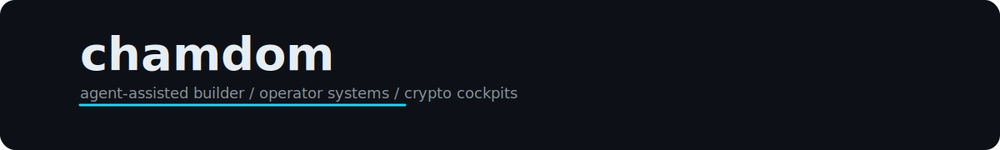

  

   
   

  

   
   

  

    
  

  

    
    
    
    
    
    
  

  

    
    
    
    
    
    
  

   

  <picture>
    <source media="(prefers-color-scheme: dark)" srcset="https://github-readme-activity-graph.vercel.app/graph?username=tmdry4530&theme=tokyo-night&hide_border=true&area=true" />
    
  </picture>

   
   

  
  

