 

 

## ❯ what I build

> Local agents, workflow dashboards, trading-signal cockpits, and product MVPs — shipped with logs, runbooks, and safety gates.

- **Agent workflows** — maintenance loops that keep existing services healthy
- **News / crypto signal systems** — paper-first, deterministic, risk-gated pipelines
- **Operator consoles** — dashboards that explain state, blockers, and the next action
- **Product prototypes** — TypeScript / React / Node / Python / C# builds that actually run

## ❯ selected work

<table>
<tr>
<td width="50%" align="left" valign="top">

**[K-Terminal](https://github.com/tmdry4530/K-Terminal)**

market / news-trading cockpit

</td>
<td width="50%" align="left" valign="top">

**[runbook-lens](https://github.com/tmdry4530/runbook-lens)**

local-first log triage & incident-brief workspace

</td>
</tr>
<tr>
<td width="50%" align="left" valign="top">

**[civicdesk-csharp](https://github.com/tmdry4530/civicdesk-csharp)**

request intake · approval · audit operations console

</td>
<td width="50%" align="left" valign="top">

**[agent-bounty-hunter](https://github.com/tmdry4530/agent-bounty-hunter)**

AI-agent bounty marketplace · ERC-8004 · x402 · Monad

</td>
</tr>
<tr>
<td width="50%" align="left" valign="top">

**[ops-console](https://github.com/tmdry4530/ops-console)**

operator console experiments

</td>
<td width="50%" align="left" valign="top">

**[SyncSpaceDesktop](https://github.com/tmdry4530/SyncSpaceDesktop)**

WPF WebView2 desktop wrapper for SyncSpace

</td>
</tr>
</table>

<picture>
  <source media="(prefers-color-scheme: dark)" srcset="https://github-readme-activity-graph.vercel.app/graph?username=tmdry4530&theme=tokyo-night&hide_border=true&area=true" />
  
</picture>

 

<picture>
  <source media="(prefers-color-scheme: dark)" srcset="https://streak-stats.demolab.com?user=tmdry4530&theme=tokyonight&hide_border=true" />
  
</picture>

 
 

<a href="https://github.com/tmdry4530">GitHub</a> &nbsp;·&nbsp;
<a href="https://tokscale.ai/u/tmdry4530">Tokscale</a>

